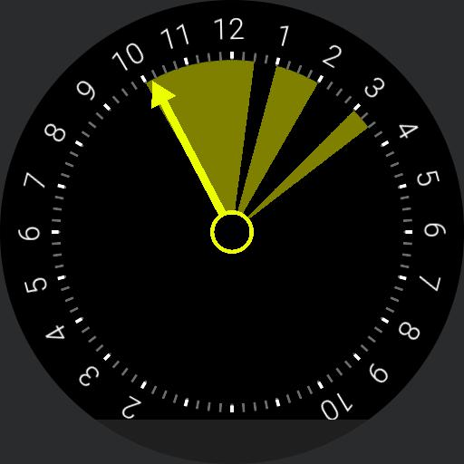
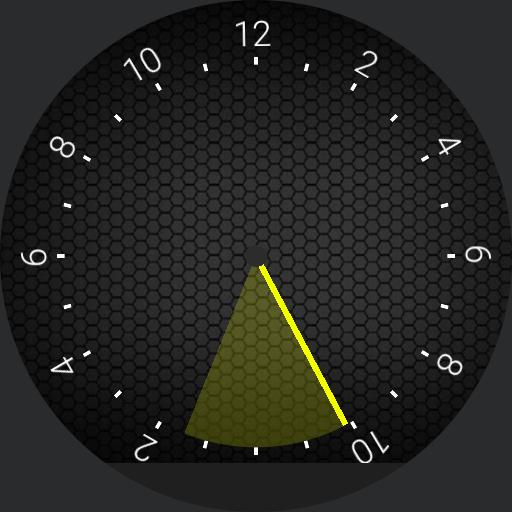

# watchmaker
Some of my attempts at watchfaces using [WatchMaker](https://play.google.com/store/apps/details?id=slide.watchFrenzy&hl=en)

Things like Anacorn and Rotating dots were just experiments to see how things worked. My primary inspirtation was [24 hour watch faces](https://24hourtime.info/). The goal at least has been to create a 'slow time' watch where you can sense the movement of time through the day.  

The biggest challenge has been screen resolution as it's hard to know when you need to leave for the 1pm meeting. Many of may experiments have been around solving that issue. 

Another idea was sparked by a comment on Twitter to take advatage of the entire day circle to layout your day's events. This has been surprisingly successful and I find it very handy to have this information available at a glance. One programming issue with WatchMaker is that it exposes events as variables and event1 is always the *next* event in your day. There doesn't appear to be any way to get all of your day's events at once.

WatchMaker exports a watchface as a single file so it's hard to really collaborate on this on GitHub. Please feel free to download, reuse and install them into WatchMaker all you wish. If you *do* come up with something fun/different, please let me know!

If you want to see the hands 'in action' open each of the gif files to see them run in elapsed time.

Slow10 is my current favorite with a wedge shaped events. The next event turns red 5 minutes before the meeting starts. 

Slow6 was my first properly working version with a 'relative minute hand' so you could see the fraction of the hour. It's relative to the hour hand not '12 noon' which some people find a bit silly. Like I said, I'm just experimenting here.

